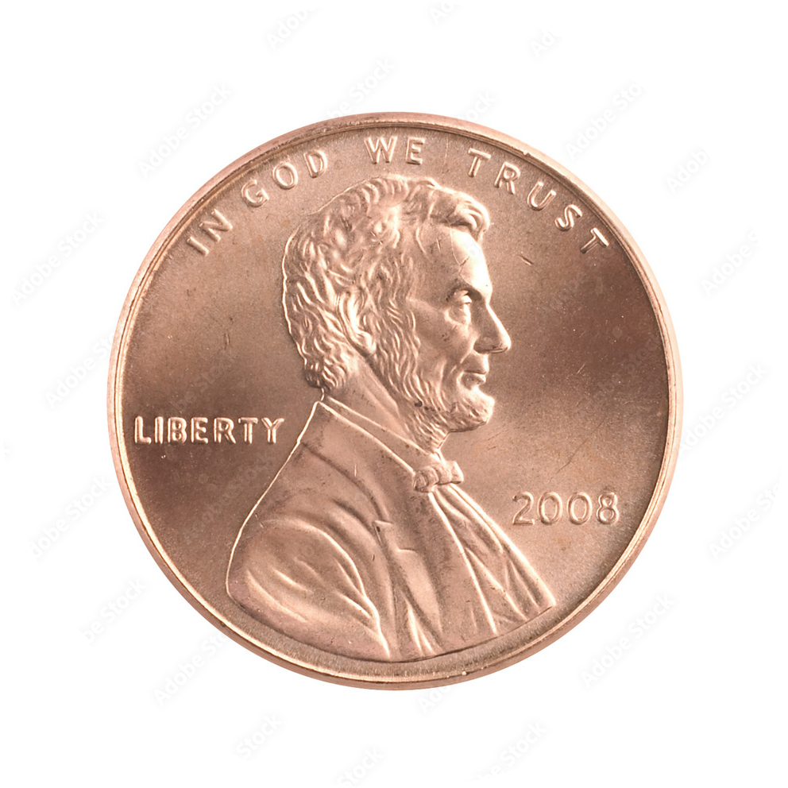

assets/money/money_assets.md
money_assets.md
Master Currency Asset List for the MMATP December Web App
This document lists every PNG money asset used in the MMATP December Theme App. It includes filenames, HTML usage examples, and the CSS size system for realistic scaling.

1. Coin PNGs
Realistic, transparent, circular PNG files

All coin images are sized using real-world diameter ratios:

Quarter: 24.26 mm

Nickel: 21.21 mm

Penny: 19.05 mm

Dime: 17.91 mm

These ratios are preserved via CSS.

Coin	Filename	Description
Penny	assets/money/coins/penny.png	Transparent circular PNG
Nickel	assets/money/coins/nickel.png	Transparent circular PNG
Dime	assets/money/coins/dime.png	Transparent circular PNG
Quarter	assets/money/coins/quarter.png	Transparent circular PNG

HTML Example
html
Copy code

2. Bill PNGs
Tightly cropped, transparent rectangle PNG files

Bill	Filename	Description
$1	assets/money/bills/bill_1.png	Transparent, tightly cropped PNG
$5	assets/money/bills/bill_5.png	Transparent, tightly cropped PNG
$10	assets/money/bills/bill_10.png	Transparent, tightly cropped PNG
$20	assets/money/bills/bill_20.png	Transparent, tightly cropped PNG
$50	assets/money/bills/bill_50.png	Transparent, tightly cropped PNG
$100	assets/money/bills/bill_100.png	Transparent, tightly cropped PNG

HTML Example
html
Copy code

3. Coin Scaling CSS
Realistic coin size ratios based on true U.S. coin diameters

css
Copy code
.coin {
  display: inline-block;
  height: auto;
}

/* Quarter is the base (adjust this number to scale all coins) */
.coin-quarter {
  width: 120px;
}

.coin-nickel {
  width: calc(120px * 0.87); /* 21.21 / 24.26 */
}

.coin-penny {
  width: calc(120px * 0.78); /* 19.05 / 24.26 */
}

.coin-dime {
  width: calc(120px * 0.74); /* 17.91 / 24.26 */
}
To change the overall scale of your coins, modify only the width in .coin-quarter.
All other coins will scale automatically.

4. Bill Scaling CSS
css
Copy code
.bill {
  display: inline-block;
  height: auto;
  max-width: 100%;
}

/* Default bill sizes */
.bill-1   { width: 280px; }
.bill-5   { width: 300px; }
.bill-10  { width: 320px; }
.bill-20  { width: 340px; }
.bill-50  { width: 360px; }
.bill-100 { width: 380px; }
5. Asset Folder Structure
Recommended folder layout inside your GitHub repo:

markdown
Copy code
assets/
  money/
    coins/
      penny.png
      nickel.png
      dime.png
      quarter.png
    bills/
      bill_1.png
      bill_5.png
      bill_10.png
      bill_20.png
      bill_50.png
      bill_100.png
    money_assets.md
6. Usage Notes
All currency images are optimized PNG assets created from your uploaded photos.

Coins use transparent circular masks for cleaner app UI.

Bills are tightly cropped for consistent grid and drag-and-drop usage.

All assets are safe for educational use within your MMATP financial literacy app.

Scaling is designed to visually match real-world size relationships.

End of file
